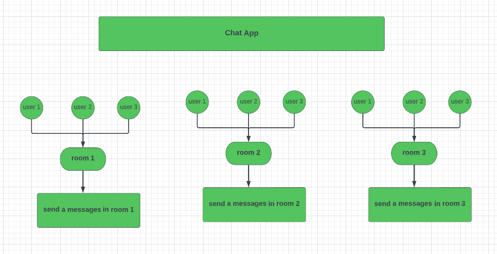

# Realtime-Chat-Application

## Documentation :
- Real-time chat application called chat App and      we're going to be using nodejs Express and websockets using socket.io .This application provides a chat service for a group of users in one room

- chat app have two page:
    
    1- Home " join chat" :
     - the user must select a username and  chat room

  2- chat room page:
   
   - this page have name of the chat room and all user connected in this chat room and the user can send a 
   message to chat area .

___

___
## UML
